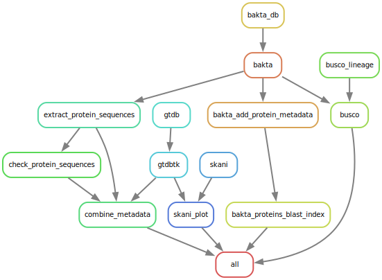

# JCA_NSW_comQXPA_rapP

PI: Nicola Stanley-Wall

The code in this repository is used to create a database of high-quality *B. subtilis* assemblies from the ENA, taxonomically classify these to ensure consistent identification then reannotate to ensure similar gene naming is present across assemblies.

Complete genomes are identified by searching the ENA portal API for assemblies with a provided NCBI taxonomy id. This returns json-formatted results inlucing the SRA accesion of each assembly.

The corresponding SRA XML files are then downloaded, and parsed. Intact genomes are identified on the basis of scaffold number, which is required to be <=5 in order to allow for plasmids. Note that it is not sufficient to look for assemblies with 0 gaps since these are not always correctly reported.

EMBL format gzip compressed records for the assemblies are downloaded into a 'genomes' directory, converted to fasta format ('fasta' directory), and blast indexed ('blast_db' directory). Following classification, completeneess checks using BUSCO and reannotation, and summary table is produced detailing the isolates metadata, classification and any reason for exclusion from the database (i.e. incorrect taxonomic classification)

## Building genome databases 

A conda environment (named `comQXPA`) containing all necessary pre-requisites can be created by running:

`conda env create -f etc/conda.yaml`

This will need to be activated prior to running the script with:

`conda activate comQXPA`

The `bin/build_genome_dbs.py` script includes an `NCBI_TAXID` constant which defines the taxonomy ID to use for retrieving the genomes. This is set to 1423 (*Bacillus subtilis*)  but can be set to any valid NCBI taxonomy accession. Not that when identifying genomes, all child taxa are included in the search i.e. strains with alternate identifiers.

Once the taxonomy identifier is set, simply run

`bin/00_build_genome_dbs.py` - it will probably take about half an hour for ~400 genomes.

Note some 404 errors (not found) are likely to be reported during the genome download phase - these will most likely result from assemblies which have metadata available but no completed submission.

The resulting data will be located in `data/full`. 
### Shell modifications

Searching the resulting blast database will require a larger number of files to be opened simultaneously then permitted by the default shell environment.

Run `ulimit -n 4096` to increase this limit from the default of 1024 prior to running a search. This can also be included in a bash script prior to a blast command.

## Main workflow

A snakemake workflow manages the main analysis processes, using docker containers for reproducibility. The workflow is designed to be run using a batch scheudling system with DRMAA submissions. It is configured to be run with a GridEngine based scheduler. This will need updating to run under different schedulers by editing the `drmaa-args` parameter of the `profile/config.yaml` file. Per-job resource requirements are also defined in this file. The workflow can be executed simply by running `bin/01_main_workflow.sh`. 

The overall organisation of the workflow is indicated in the figure below:

### GTDB-TK

Taxonomic classification is carried out using GTDB-TK. The workflow will first download GTDB, retrieving the version specified by the `gtdb_version` variable at the top of `workflow/Snakefile`. GTDB-TK is then run on each genome assembly.

### Bakta

Genome reannotation is carried out using Bakta, first retrieving the required databases as with the taxonomic classification. Annotated protein sequences are then labelled with the isolate identifier to ease downstream analysis, before a blast database of per-genome protein sequences, including an overarching `Bacillus_subitilis_proteins` database.

### Busco

Genome completeness is assessed using Busco, again pre-downloading the required lineage. This is defined by the `busco_lineage` variable at the top of `workflow/Snakefile`. The `bacillales_odb10` lineage was used for this assessment.

### Protein sequence extraction

Sequences of the comQXPA genes and rapP are extracted from the annotated assemblies using the `bin/extract_protein_sequences` script. Mutations within the sequences (especially comP and comQ) can result in them not being fully represented, and consequently misannotated. They are also highly polymorphic, making them difficult to accurately identify by similarity. comX, however, is a relativey stable, and consistently annotated gene within the operon, so has been used as an anchor, with relative positions of adjacent genes used to select the appropraite sequences. This is complicated further by i.e. transposon insertions within the operon, requiring a small number of edge cases to be handled in the `get_target_sequences()` function of `bin/common.py`

A round of BLAST-based similiarity searches are then carried out to ensure that no i.e. duplicated genes are missed. Proteins from *B. subtilis 168* from Subtiwiki  are compared in a pairwise manner to those isolated from the assemblies, and a TBLASTN search of each target protein (comQXPA and rapP) against the genome to identify if there are multiple candidates present. The results are stored in a `protein_coverage.txt` tab-delimted file.

### Metadata finalisation and genome selection refinement

The various tables of metadata are finally merged, and criteria assessed as to whether sequences should be retained or not, and the reaons(s) for rejecting them. The following criteria are applied:

* Taxonomic classification: *Bacillus subtilis*
* BUSCO completeness: >98%
* Assembly title: Does not contain 'genome-engineer' or 'mutant'

Assemblies meeting criteria for retention are placed within in the `data/refined` directory for subsequent analysis. A configuration file for bcgTree phylogenetic analysis is also created at this point.

## Phylogenetic Analysis

Genome phylogeny is determined using bcgTree and IQTree using the `bin/02_genome_phylogeny.sh` script. bcgTree identifies 107 essential single copy genes which are used to create a multiple-sequence alignment using Muscle which is refined with GBlocks. It then uses RaxML to generate a tree, however this requires an extensive runtime, consequently the script comments out the line within the bcgTree code which calls RaxML, and instead uses the bcgTree alignment with IQTree. 

Additional scripts (`bin/03* - bin/05*`) are used to generate additional alignments and trees presented in the manuscript

